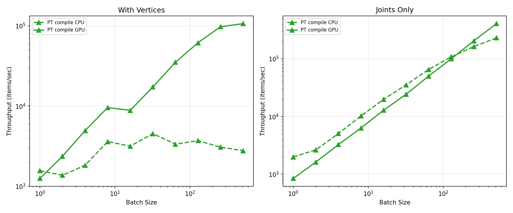

# Benchmark Results



## Summary (RTX 4090)

**With Vertices (batch=64):**
| Backend | Throughput |
|---------|------------|
| NumPy | 83/sec |
| Numba | 2,600/sec |
| PT compile GPU | **64,000/sec** |
| TF function GPU | 40,000/sec |

**Joints Only (batch=64):**
| Backend | Throughput |
|---------|------------|
| Numba | **152,000/sec** |
| NumPy | 95,000/sec |
| PT compile GPU | 69,000/sec |

For joints-only, CPU backends win due to GPU kernel overhead.

## Usage

```bash
python benchmark/run_benchmark.py  # Generate results.json
python benchmark/plot_results.py   # Generate plots
```
